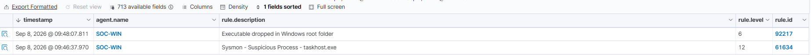
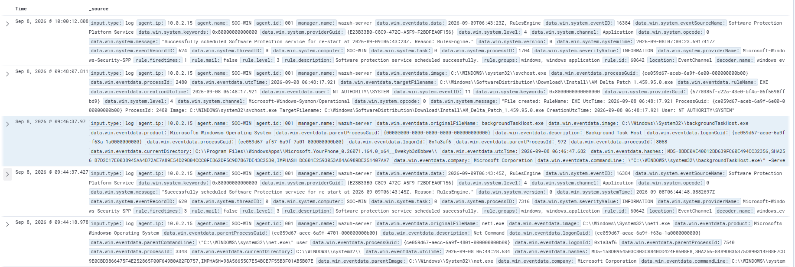

# SOC Lab – Wazuh & Sysmon

## Overview

This project is a hands-on Security Operations Center (SOC) lab designed to practice security monitoring, log analysis, threat detection, and alert investigation.

The lab uses Wazuh as the SIEM/XDR platform and Sysmon to provide detailed Windows endpoint telemetry. A Windows 11 virtual machine acts as the monitored endpoint, while an Ubuntu Server hosts the Wazuh components.

## Lab Architecture

- Windows 11 – Monitored endpoint
- Sysmon – Endpoint telemetry and process monitoring
- Wazuh Agent – Log forwarding
- Ubuntu Server 24.04 LTS – Wazuh Server
- Wazuh Dashboard – Alert monitoring and investigation
- VirtualBox – Virtualized lab environment

## Skills Demonstrated

- SOC alert triage
- Windows event log analysis
- Sysmon telemetry analysis
- SIEM monitoring with Wazuh
- Process and command-line analysis
- Alert correlation
- False-positive investigation
- Basic incident investigation

## Alert Investigation

### Case 1 – High-Severity Suspicious Process Alert

**Alert:** Sysmon - Suspicious Process - `backgroundTaskHost.exe`  
**Wazuh Severity:** Level 12  
**Endpoint:** SOC-WIN  
**Final Classification:** False Positive / Benign Activity

*Figure 1: Wazuh Level 12 suspicious process alert detected on the SOC-WIN endpoint.*

#### Investigation

Wazuh generated a Level 12 alert for `backgroundTaskHost.exe`. Due to the high severity, the alert was investigated before determining whether the activity was malicious.

The investigation included:

- Reviewing the executable path and command line.
- Verifying the process publisher and associated application.
- Reviewing surrounding events to identify related suspicious activity.
- Examining user and process information.
- Correlating nearby discovery activity with known lab actions.

The process was executed from:

`C:\Windows\System32\backgroundTaskHost.exe`

The event identified Microsoft Corporation as the publisher and showed that the process was associated with Microsoft Phone Link (`Microsoft.YourPhone`).

During timeline analysis, a nearby `net user` event was identified. Although this command can be associated with account discovery, it was confirmed to be an authorized command manually executed during SOC lab testing.

No additional evidence of malicious activity was identified.

*Figure 2: Surrounding events reviewed to correlate activity around the Level 12 alert.*

#### Conclusion

The alert was classified as a **false positive / benign activity** after investigation. This case demonstrated the importance of validating high-severity alerts using process information, command-line analysis, timeline correlation, and environmental context rather than relying on alert severity alone.
