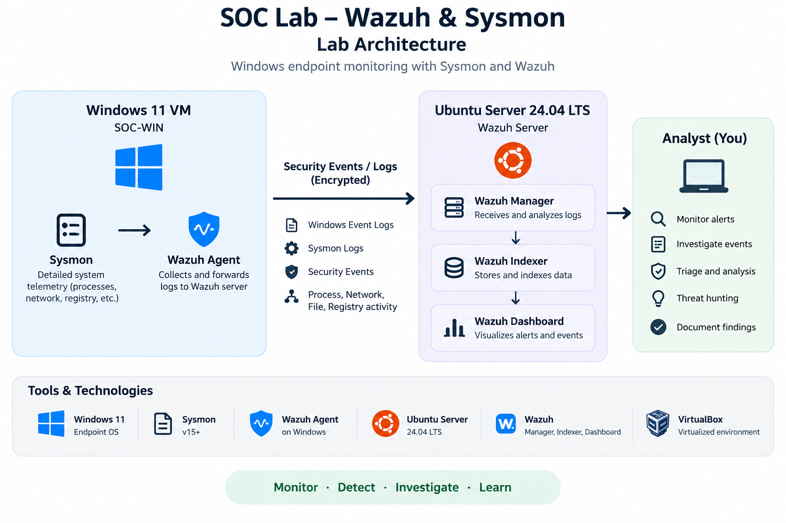

# SOC Lab – Wazuh & Sysmon

## Overview

This project is a hands-on Security Operations Center (SOC) lab designed to practice security monitoring, log analysis, threat detection, and alert investigation.

The lab uses Wazuh as the SIEM/XDR platform and Sysmon to provide detailed Windows endpoint telemetry. A Windows 11 virtual machine acts as the monitored endpoint, while an Ubuntu Server hosts the Wazuh components.

## Lab Architecture

- Windows 11 – Monitored endpoint
- Sysmon – Endpoint telemetry and process monitoring
- Wazuh Agent – Log forwarding
- Ubuntu Server 24.04 LTS – Wazuh Server
- Wazuh Dashboard – Alert monitoring and investigation
- VirtualBox – Virtualized lab environment

## Skills Demonstrated

- SOC alert triage
- Windows event log analysis
- Sysmon telemetry analysis
- SIEM monitoring with Wazuh
- Process and command-line analysis
- Alert correlation
- False-positive investigation
- Basic incident investigation
